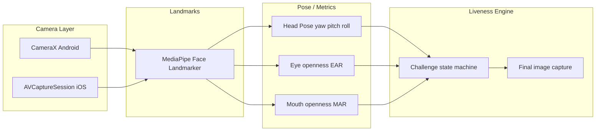

# Liveness Detection Library Docs

## Architecture



Camera and UI are separated: the core library receives frames, computes pose/EAR/MAR, runs a deterministic state machine, and captures a single still image only after all steps pass.

---

## Challenge sequence

1. **Turn your head LEFT** → `yaw < -15°`
2. **Blink** → open → closed → open within 1 second
3. **Turn your head RIGHT** → `yaw > +15°`
4. **Nod your head** → pitch down then up
5. **Open your mouth** → MAR above threshold

Each step has a timeout and fails on incorrect motion. After all pass, the system waits ~300–500 ms, verifies face frontal and eyes open, then captures a single high-quality JPEG.

---

## Thresholds and metrics

**Head pose (yaw/pitch/roll)**  
Prefer facial transformation matrix (if available) and fall back to landmark-based estimation.

**Eye openness (EAR)**  
Uses 6 landmarks per eye. Default indices:

- Left eye: 33, 160, 158, 133, 153, 144
- Right eye: 362, 385, 387, 263, 373, 380

**Mouth openness (MAR)**  
Default indices:

- Mouth corners: 61 (left), 291 (right)
- Upper/Lower lip: 13 (upper), 14 (lower)

**Default thresholds**  
See `LivenessConfig`:

- Android: `android/liveness/src/main/java/com/liveness/detection/LivenessConfig.kt`
- iOS: `ios/LivenessDetection/LivenessConfig.swift`

---

## Tuning

Adjust thresholds in `LivenessConfig` to fit your device and user population:

- **Angles:** `yawLeftThreshold`, `yawRightThreshold`, `frontalYawThreshold`, `frontalPitchThreshold`
- **Blink:** `blinkOpenThreshold`, `blinkClosedThreshold`, `blinkMaxDurationMs`
- **Mouth:** `mouthOpenThreshold`
- **Nod:** `nodDownThreshold`, `nodUpThreshold`
- **Timeouts:** `stepTimeoutMs`, `blinkTimeoutMs`, `mouthTimeoutMs`, `nodTimeoutMs`

Recommended process:
1. Collect sample sessions for your target device.
2. Plot EAR/MAR distributions for open/closed eyes and mouth.
3. Adjust thresholds and timeouts to minimize false failures.

---

## Capacitor integration (WebView, no new Activity)

Package: `@daboss/liveness-capacitor`

**Install**
```
npm install @daboss/liveness-capacitor
```

**Usage**
```ts
import { LivenessDetector } from "@daboss/liveness-capacitor";

const start = async () => {
  const sub1 = LivenessDetector.addListener("challengeChanged", (event) => {
    console.log("Step:", event.stepLabel);
  });
  const sub2 = LivenessDetector.addListener("failure", (event) => {
    console.log("Failed:", event.reason);
  });

  const result = await LivenessDetector.startLiveness();
  console.log("Image base64 length:", result.imageBase64.length);

  sub1.remove();
  sub2.remove();
};
```

**Behavior**  
The plugin runs inside the **same Activity** hosting the WebView and adds a native preview overlay. No new Activity or native screen is created.

---

## React Native (TurboModule, Expo 54)

Package: `@daboss/liveness-react-native`

**Install**
```
npm install @daboss/liveness-react-native
```

**Expo 54**  
Add the config plugin and run prebuild:

```
// app.json
{
  "expo": {
    "plugins": ["@daboss/liveness-react-native"]
  }
}
```

```
npx expo prebuild
```

**Usage**
```ts
import {
  startLiveness,
  addChallengeChangedListener,
  addFailureListener
} from "@daboss/liveness-react-native";

const sub1 = addChallengeChangedListener((event) => {
  console.log("Step:", event.stepLabel);
});
const sub2 = addFailureListener((event) => {
  console.log("Failed:", event.reason);
});

const result = await startLiveness();
console.log("Image base64 length:", result.imageBase64.length);

sub1.remove();
sub2.remove();
```

---

## Model file

Use the official `face_landmarker.task` model.

- **Android**: Auto-downloaded via Gradle in `android/liveness/download_tasks.gradle`.
- **iOS**: Add `face_landmarker.task` to the framework or app bundle (required for `LivenessDetector` to start).

---

## References (ground truth)

- Android sample: https://github.com/google-ai-edge/mediapipe-samples/tree/main/examples/face_landmarker/android
- iOS sample: https://github.com/google-ai-edge/mediapipe-samples/tree/main/examples/face_landmarker/ios
- MediaPipe repo: https://github.com/google/mediapipe
- Face Landmarker guide: https://ai.google.dev/edge/mediapipe/solutions/vision/face_landmarker
